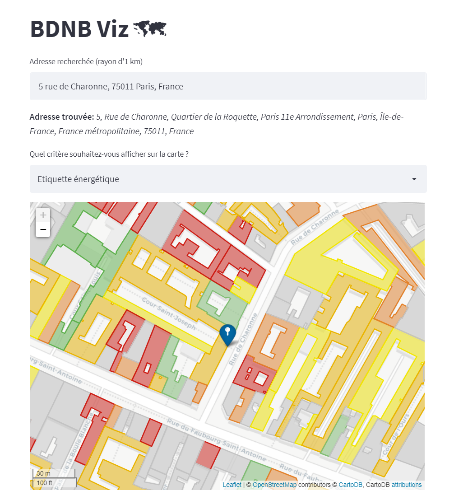
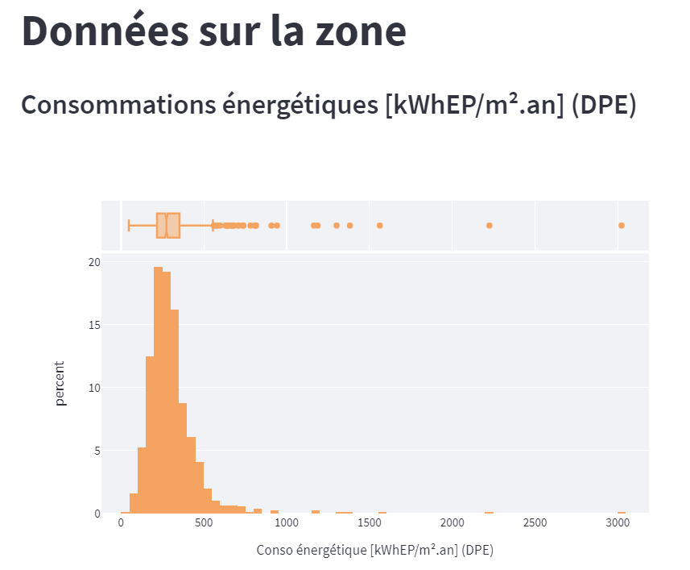
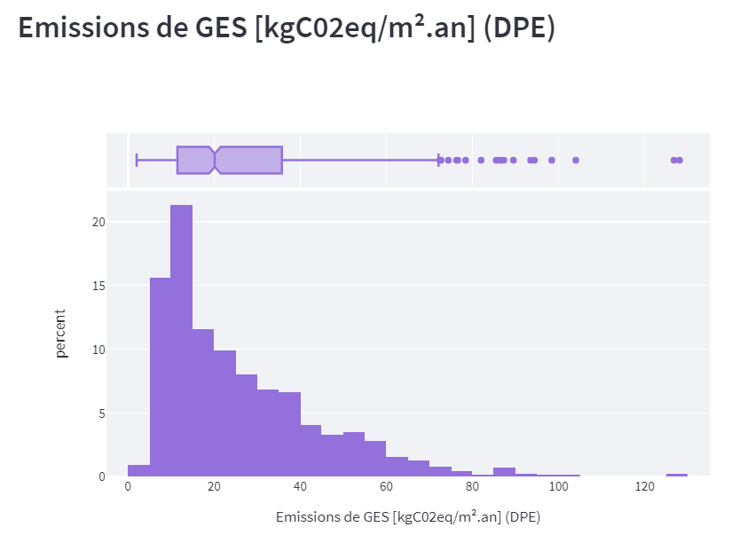
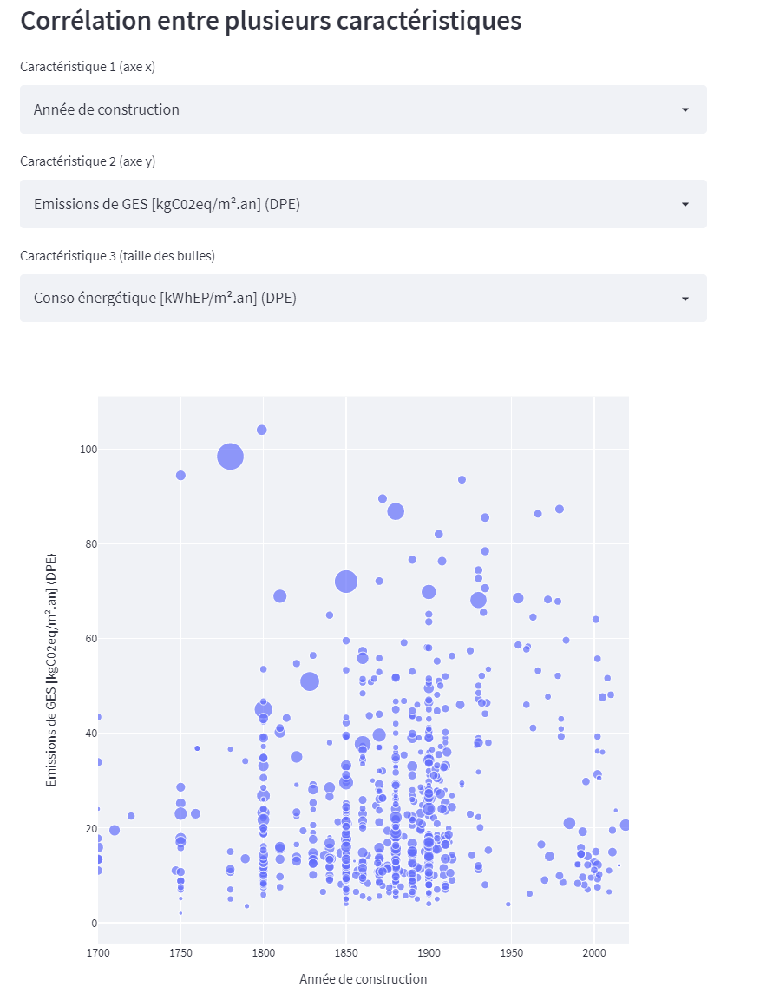

# BDNB Data visualisation

Python-based visualisation tool for french [BDNB database](https://www.data.gouv.fr/fr/datasets/base-de-donnee-nationale-des-batiments-version-0-6/).

## ⚡ Web App
The Web App is hosted at: [https://bdnb-viz.herokuapp.com](https://bdnb-viz.herokuapp.com/)

First you need to enter the address you are looking for.
Informations of buildings within a 1 km radius from this address will then be displayed:

You also get a few plots the summarize the displayed data:

